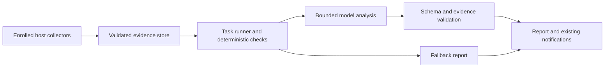

# Background Agent Capabilities

Status: proposed, unscheduled project brief, 2026-09-27. This document recommends
non-coding agent capabilities and a delivery sequence; none of the proposed
task commands or services below are implemented by this plan. The
[roadmap](ROADMAP.md) continues to own project priority, including P0 execution
and state guarantees and P1 observation contracts.

## Recommendation

Build a small **background operations assistant** that can run without T3 Code,
a desktop, or an interactive coding-agent session. Start with a daily operations
brief and a durable, bounded task runner. Add incident investigation next, then
recovery verification and drift review as their underlying operations mature.

The useful product is an answer to “What needs my attention, what evidence
supports it, and what can I do next?” Scheduling makes that answer arrive at
the right time. Models contribute interpretation across several sources;
ordinary code should own collection, thresholds, scheduling, permissions, and
execution results.

Assume an initial deployment with one operator and roughly 5–20 Debian hosts
or Proxmox guests. That is a pilot scope, not a supported capacity claim. Keep
installation optional and compatible with a small existing controller. Do not
require an additional database server, a GPU, or a model process on every host.

The three best initial investments are:

1. **An operations brief:** summarize new failures, recoveries, incomplete
   checks, and approaching problems into a short, evidence-linked report.
2. **Incident investigation:** turn a security or service event into a bounded
   investigation with a timeline, competing explanations, and next checks.
3. **Recovery verification:** run approved restore drills in disposable targets
   and explain whether the restored application actually works.

The runner is shared infrastructure for these features, not a separate ambition
to build a general workflow platform. A useful brief should ship before a
visual workflow editor or unrestricted task authoring.

## What Basaltwater already provides

These are repository capabilities inspected for this brief, not evidence that
they are enabled or healthy on any particular live host.

| Existing foundation | Reuse | Gap this project must address |
| --- | --- | --- |
| [Recurring maintenance](../MAINTENANCE.md) and [storage operations](../STORAGE_OPERATIONS.md) | Timers, per-operation cadence, locks, bounded holds, and failure reporting | A durable task history and explicit missed-run, budget, and cancellation policies |
| [Notifications](../NOTIFICATIONS.md) | Schema-v2 event IDs, incident grouping, structured facts, and existing destinations | Durable evidence intake; delivery is currently best effort and notification levels can suppress events |
| [Security monitoring](../../security/service_tools/security_monitor.py) | SSH/fail2ban summaries, protected-file evidence, source health, and certificate observations | Cross-event explanation and bounded follow-up investigation |
| [Web panel](../WEB_PANEL_REFERENCE.md) | Authenticated views, sanitized audit export, bounded diagnostics, and scheduled-job status | Persistent task results and source coverage beyond the latest panel snapshots |
| [Sysadmin operations](../SYSADMIN.md) and [Proxmox operations](../PROXMOX.md) | Existing health, service, resource, and maintenance observations | A shared, versioned evidence envelope with freshness and provenance |
| [Deployment safety](../DEPLOYMENT_SAFETY.md) and [recovery roadmap](ROADMAP.md#p2-recovery-as-a-first-class-workflow) | Existing backups and verification boundaries | Supported isolated restoration and application-specific assertions |

The panel retains only the latest 100 ingested notifications; its audit view
is a bounded 24-hour snapshot. Neither is a complete incident archive. A daily
brief must report missing coverage until it has a suitable durable source.
Likewise, Gatus and Beszel remain proposed integrations in the
[monitoring plan](LIGHTWEIGHT_SERVICE_CANDIDATES.md); this project may consume
their observations later but must not depend on them for its first release.

## Candidate ranking

This is a product judgment, not a benchmark. Favor repeated operator value,
reuse of managed-host facts, and outcomes that can be independently verified.
Effort is relative: small means a bounded recipe on an existing runner; medium
adds a collector or policy surface; large adds remote execution or recovery.
All recipe estimates exclude the shared runner foundation.

| Rank | Capability and concrete use | Model contribution | Effort / decision |
| --- | --- | --- | --- |
| 1 | Daily operations brief: “What changed overnight, and what requires action?” | Consolidate related symptoms, explain impact, and rank follow-up work | Small–medium; first user-facing feature |
| 2 | Security and service incident investigator: explain an unexpected protected-file change or recurring 502s | Build an evidence-backed timeline and choose from allowed diagnostic checks | Medium; second feature, initially advisory |
| 3 | Recovery rehearsal: restore last night's application backup to a disposable target | Explain failures and gaps in the recovery procedure | Large; highest-value follow-on, gated by recovery APIs |
| 4 | Drift and exposure review: compare declared services, access, versions, and certificates with observations | Explain consequences and draft a change plan | Medium; reuse P1 audit contracts |
| 5 | Maintenance coordinator: propose an update window that avoids backups, active work, and simultaneous replica outages | Explain the schedule and tradeoffs | Large; deterministic constraints first, execution later |
| 6 | Capacity and storage advisor: identify sustained disk growth, inode pressure, or an approaching resource limit | Relate trends to workloads and propose options | Medium; requires retained history, no automatic deletion |
| 7 | Living runbooks and incident memory: draft a postmortem and retrieve similar resolved incidents | Extract lessons and answer questions with sources | Small–medium after incidents exist; retain operator-reviewed conclusions |
| 8 | Release and advisory watch: match upstream changes to installed services and supported versions | Summarize relevance and draft an upgrade checklist | Medium; authoritative feeds and package applicability checks required |
| 9 | Document intake and inventory reconciliation: extract equipment or warranty details from approved folders | Turn unstructured documents into reviewable records | Medium; optional application recipe after operational value is proven |
| 10 | Browser service journeys: periodically check a login or application workflow | Explain failures from deterministic steps and bounded evidence | Medium–large; useful after basic service monitoring, separate test accounts |

The first two save attention immediately with data already available. Recovery
rehearsals rank above a general chatbot because they produce independently
testable evidence. Scheduling is valuable even when it never invokes a model;
it should not spend tokens deciding whether a timer is due.

Calendar/email assistants, broad web research, and content publishing are
plausible user-authored jobs, but poor first-party priorities. They need many
external connectors and permissions while making less use of Basaltwater's
infrastructure knowledge. Document intake is the most promising first
non-operations experiment because it can start with a bounded local folder
and produce drafts for an existing inventory workflow.

## First recipes and their operator experience

### Daily operations brief

At a configured local time, collect the previous reporting window from
explicitly enrolled hosts. Show new issues, unresolved issues whose evidence
changed, recoveries, and missing observations. Include failed maintenance,
service health, backup freshness where available, security findings, and
certificate or capacity warnings. Do not equate a fresh backup with a tested
restore or a running service with customer-visible availability.

Example output, using fictional evidence:

> **Two items need attention.** The file server's mirror has failed twice
> because its destination was unavailable (events E17 and E23). The web host
> recovered after its application restart (E31–E34); the timing suggests a
> relationship but does not establish cause. Security observations from the
> backup host are unavailable since 03:10 (E40). No conclusion is available
> for that interval.

Each item links to retained facts and gives a next check. Counts, timestamps,
severity floors, and freshness come from code. The model writes the concise
explanation. If there are no changes, render a compact deterministic report;
if the model fails, deliver the same underlying facts with “analysis unavailable.”
Deliver to the configured panel or existing notification destinations, with
one stable report ID so retries do not create another incident.

### Incident investigator

Start from an explicit incident ID, an operator request, or an allowlisted
event type after deterministic deduplication and rate limiting. The initial
recipe correlates SSH failures, bans, protected-file findings, service failures,
deployment results, and maintenance windows only where those facts exist.
Absence of a source is visible evidence about coverage, never an all-clear.

A service investigation may request a fixed service status check, a bounded
journal interval, or an enrolled endpoint probe. A security investigation may
request additional sanitized audit observations. Each tool has typed arguments,
fixed host scope, output limits, and a read-only implementation. Logs cannot
supply new tool definitions or arbitrary shell commands.

The result separates observations, hypotheses, unknowns, and recommended
checks. It must not call an actor malicious solely because an address was
banned, infer compromise from an audit hit alone, or silently dismiss an event
because maintenance happened nearby. Existing collection can omit expected
setup activity; the report must preserve that coverage limitation.

Preserve deterministic alert delivery independently of analysis. A model can
recommend escalation, but cannot suppress an alert, change firewall rules,
disable accounts, or restart a service in the initial project. Human feedback
records useful, duplicate, unsupported, or missed findings for evaluation.

### Recovery rehearsal

Begin with a recovery inventory: last backup, last verified restore, protected
assets, missing dependencies, and unresolved failures. Once the recovery
roadmap exposes supported restore operations, add a scheduled drill with an
operator-selected backup, isolated target, resource quota, and cleanup policy.

Restore into a disposable VM or application instance with production network
access and outbound notifications disabled by default. Run explicit assertions:
the database opens, expected sample records exist, required files are readable,
and a representative application request succeeds. Record elapsed restore
time and the age of the recovered data against configured objectives.

The model explains a failed assertion and drafts runbook corrections; it does
not decide whether the drill passed. A successful restore command alone is
insufficient. Cleanup may remove only resources carrying this drill's recorded
identity. A failed cleanup is a visible outstanding task, never permission to
delete a similarly named production resource.

## Scheduling and execution outside T3 Code

### A deliberately small runtime

Use one opt-in service account, one worker initially, systemd supervision, and
a local durable store. SQLite is the proposed run/evidence store; use schema
versions, transactional claims, a supported backup method, and bounded
retention. Keep it on local storage rather than SMB or SSHFS. A single active
controller owns each task; high availability and distributed workers are out
of scope for the first version.

Use systemd for wakeups and process resource limits, with an application record
for logical runs and missed-run policy. Calendar triggers, persistence, and
jitter are existing systemd primitives, not new scheduling algorithms. A timer
trigger does not by itself establish job completion or exactly-once effects.
See the [upstream timer contract](https://github.com/systemd/systemd/blob/main/man/systemd.timer.xml).

Manual and scheduled runs enter the same queue. Event-triggered runs follow
after durable intake works. Start with fixed recipes and bounded model calls;
add a limited tool-selection loop for the investigator only when its evidence
and permission tests pass. No open-ended “keep improving the fleet” objective.

The worker must run with T3 stopped and no logged-in desktop user. Use a
dedicated provider credential reference with explicit permissions and budgets,
not a copied interactive login. Keep provider choice behind a small adapter
for requests, structured results, timeouts, and usage accounting. Select one
provider during the implementation spike; do not build several SDK integrations
before a recipe proves useful. Local inference is an optional later adapter
with its own resource budget, not a prerequisite.

### Task contract

| Field group | Required behavior |
| --- | --- |
| Identity | Task ID, owner, enabled state, recipe version, and configuration revision |
| Trigger | Manual, calendar, or approved event; named timezone; recorded scheduled instant; explicit daylight-saving and missed-run policy |
| Scope | Enrolled hosts, allowed evidence sources, approved tool names, and destinations |
| Authority | Observation/reporting by default; any later write operation has an explicit capability and operation contract |
| Limits | Wall time, tool calls, input/output size, concurrency, model tokens, and spend allowance |
| Delivery | Report location, notification policy, deduplication key, and independent delivery status |
| History | Logical run ID, attempt IDs, evidence references, model/recipe versions, usage, outcome, and retained error details |

Suggested future CLI names are `basaltw task list`, `show`, `run`, `history`,
`pause`, and `cancel`. These are design sketches, not runnable commands today.
The panel should show next run, last useful result, stale sources, remaining
budget, and failures. Start with read-only panel results; add controls through
the same task API after authorization and CSRF handling are implemented.

### Failure and scheduling semantics

- Persist a logical run before dispatch. Uniqueness includes the task revision
  and scheduled instant or source event ID. Treat delivery as at least once;
  deduplicate at intake and make supported side effects idempotent.
- On restart, distinguish interrupted attempts from queued work. Read-only
  collection may retry within its budget; an ambiguous future mutation must
  reconcile its operation record before any repeat execution. A lost worker
  lease does not prove that a remote operation stopped.
- Default missed daily briefs to one catch-up run over a bounded window, with
  the uncovered interval stated. Do not replay a week of reports after a
  controller outage. Define repeated/missing local times explicitly and test
  daylight-saving changes and clock jumps.
- Limit each task to one active run. Queue or coalesce repeated event triggers
  and expose dropped/coalesced counts. Preserve the original critical alerts
  even when analysis is rate limited.
- Retry transient provider/network failures with bounded backoff. Invalid
  configuration, denied access, corrupt state, and exhausted budgets require
  an actionable failure rather than an endless retry loop.
- Enforce cancellation through the supervised process group and bounded tool
  calls. Record incomplete remote work honestly. Track notification delivery
  separately so a failed webhook does not rerun successful collection.
- Unknown prerequisites block dependent work. Resource pressure, maintenance
  holds, and outage windows are explicit scheduling inputs; normal holds must
  not silently override an existing forced-restart deadline.

### Relationship to the existing scheduler

The [recorded scope of scheduling issue #28](GITHUB_ISSUE_TRIAGE_2026-08-17.md)
includes maintenance windows, cross-host coordination, and resource ordering.
This brief supplies a proposed direction; it does not change the live issue's
status or claim those capabilities are delivered.

Keep [storage-ops](../../sync/service_tools/storage_ops.py) as the sole owner
of sync/scrub cadence, backoff, state, and locks. The first task runner only
observes those jobs. Later coordination must extend that orchestrator and
expose its constraints; it must not independently schedule the same sync or
scrub. Preserve the existing timers until an explicit migration transfers
ownership and verifies that only one scheduler can dispatch an operation.

For maintenance coordination, start with a proposed calendar generated by
deterministic constraints: target availability, active holds, storage jobs,
dependency order, and maximum concurrent disruptions. The model explains
conflicts. Execution remains with the owning maintenance/deployment commands
and their recovery contracts, gated by the roadmap's P0/P2 work.

## Evidence, authority, and operating cost

### Evidence flow

Define a versioned evidence envelope with source identity, event and receipt
times, collection window, source health, stable ID, schema version, and
truncation/redaction indicators. Prefer structured security and operation
results to raw logs. Track collector coverage independently of outbound
notification level; `normal` notifications do not contain every successful job.

The first pilot can collect local snapshots into a private store with explicit
gaps. Fleet intake needs per-source authentication, verified TLS or enrolled
SSH host keys, bounded payloads, replay deduplication, and source authorization.
Do not promote the panel's descriptive sender name or shared ingest token into
a trusted fleet identity. The current notification transport also permits
unverified HTTPS certificates by default; authenticated evidence collection
must require verified peer identity rather than inherit that compatibility mode.

Reports reference only evidence IDs provided to that run. Validation checks
references and schema mechanically; whether a citation actually supports an
interpretation still requires evaluation. Preserve structured source facts
alongside the narrative, and expose stale, missing, or truncated observations.
No vector database is needed initially: filter by host, service, time, event
type, and incident ID. Introduce semantic retrieval only for a demonstrated
runbook or incident-memory use case.

### Model and tool boundaries

Logs, HTTP responses, documents, and retrieved runbooks are untrusted input.
An attacker may place instructions in any of them. Keep that content outside
task policy; enforce tool scope in code, escape report rendering, and test
hostile evidence. These boundaries follow the layered controls described in
[OWASP's prompt-injection guidance](https://cheatsheetseries.owasp.org/cheatsheets/LLM_Prompt_Injection_Prevention_Cheat_Sheet.html).

Collection requiring privilege remains a narrow host-side exporter. The model
worker does not receive root, a general shell, raw credential stores, or fleet
administrative SSH keys. Separate report storage from task definitions and
credentials. A model response cannot modify its own permissions, schedule,
retention, budget, or recipient list.

Configure which data classes may leave the host. Redaction is imperfect, so
remote analysis of application logs must be an explicit recipe setting; raw
logs stay local by default. Provider outage, denied egress, invalid model JSON,
or suspicious output produces a degraded report while deterministic monitoring
continues. Model-generated advice never becomes a trusted runbook or executable
operation without the applicable review and validation.

If later recipes perform writes, use specific pre-authorized operations or an
approval tied to exact arguments, target, expiry, and current preconditions.
Do not require repeated approval for an already authorized bounded recipe,
and do not treat approval of a prose recommendation as approval of arbitrary
commands. Reuse existing operation and privilege boundaries where they fit.

### Budgets and retention

Use a configurable per-run token ceiling and reserve worst-case estimated
spend before dispatch, including allowed retries. Maintain task and global
allowances atomically; reconcile actual usage after completion. Unknown prices
or missing usage must not silently mean zero cost. Avoid claiming exact invoice
control: provider billing and requests interrupted after submission can differ
from locally observed usage.

A pilot could allow one fleet brief daily and at most five investigation runs
per day. At an illustrative average of $0.10 per brief and $0.25 per
investigation, a 30-day upper-volume month would be $40.50 before retries.
These are hypothetical per-run costs, not current provider prices or a forecast.
Measure input/output tokens and real usage before choosing the default budget;
reduce evidence volume and call frequency before changing model size blindly.

Proposed starting retention is seven days for sanitized evidence excerpts and
30 days for reports and run metadata, with explicit byte limits. Keep raw logs
under existing host policies. Reports must mark expired citations; retain a
bounded evidence bundle with any incident deliberately pinned by an operator.
Disabling tasks stops dispatch and preserves history; removal names retained
data and credentials. Backup/restore must not reactivate old queued runs or
reuse a stale controller identity without reconciliation.

## Build versus integrate

The following is an architectural recommendation based on upstream documentation
reviewed on 2026-09-27, not a performance or security evaluation.

| Option | Relevant upstream capability | Decision for Basaltwater |
| --- | --- | --- |
| Small native runner with systemd and SQLite | [systemd timers](https://github.com/systemd/systemd/blob/main/man/systemd.timer.xml) supply time-based activation and persistence | Recommended for a few fixed recipes; Basaltwater still owns durable run records, limits, and recovery tests |
| n8n | [Self-hosted workflow service](https://docs.n8n.io/deploy/host-n8n/) with its own deployment and operational lifecycle | Consider an optional integration when connector-heavy business workflows become a concrete need; avoid making it a core dependency |
| Windmill | [Server, workers, and PostgreSQL](https://www.windmill.dev/docs/advanced/self_host), plus [flow retries and timeouts](https://www.windmill.dev/docs/flows/error_handling) | Strong candidate for a separate automation installation; mandatory PostgreSQL conflicts with the initial lightweight service boundary |
| Temporal | [Durable workflow execution](https://docs.temporal.io/) across failures | Revisit if multi-worker, long-lived workflows become a real requirement; its separate service and worker model exceeds this pilot's scope |

Do not create a general DAG language, workflow designer, or provider plugin
marketplace in the native runner. Reconsider integration if recipes require
long-lived human waits, complex branching, multiple controllers, or many SaaS
connectors. Avoid spending months recreating those platforms to deliver a
daily brief. Any external automation tool should invoke the same bounded task
and operation interfaces rather than acquire unrestricted fleet access.

## Delivery plan and acceptance gates

These are ordered work packages, not calendar commitments. Assign an explicit
roadmap slot before implementation. Observation-only work can be scoped without
waiting for every recovery feature; mutation work remains dependency-gated.

| Phase | Deliverable | Exit gate |
| --- | --- | --- |
| 0 — Evidence and baseline | Select one controller and a small host cohort; inventory available sources; define evidence and run schemas; build replay fixtures and a deterministic brief | Missing sources are explicit; no secrets in fixtures; operator records baseline review time and useful findings |
| 1 — Useful scheduled brief | Manual/daily fixed recipe, durable single-worker state, one provider adapter, budgets, deterministic fallback, and report history | Runs with T3 stopped; restart, duplicate-trigger, timezone, cancellation, provider failure, and budget-exhaustion checks pass |
| 2 — Bounded investigation | Durable event intake, incident grouping, allowed diagnostic tools, evidence citations, and feedback | Replay evaluations pass; hostile log content cannot alter tools or policy; original alerts are delivered independently |
| 3 — Drift and recovery evidence | Add P1 audit observations and recovery inventory; then one isolated restore recipe after P2 APIs exist | A deliberately broken backup fails the drill; a valid backup passes application assertions; isolation and cleanup are verified |
| 4 — Coordinated work and selected recipes | Extend scheduler #28 through existing owners; add capacity advice and reviewed runbook memory | No duplicate maintenance dispatch; resource limits and operation recovery hold; each new recipe demonstrates operator value |

Suggested implementation ownership, subject to the phase-0 design review:

- Keep task state, scheduling, policy, and provider adapters in a focused owning
  package; compose installation through the appropriate `plugins/` builder.
- Keep security collectors with `security/`, storage coordination with `sync/`,
  and deployment/recovery execution with their existing owners. Reuse shared
  validators, machine capability checks, and command execution boundaries.
- Extend `lib/notifications.py` and panel result views through versioned
  contracts; do not place model execution in an HTTP request handler or in
  `security_monitor.py`'s critical collection path.
- Document actual CLI/setup behavior only when implemented. Register focused
  tests in `run_tests.py`, mock system/provider calls, and use temporary state.

Before enabling recurring model analysis, verify:

1. The worker survives a restart without losing queued work or duplicating a
   completed logical report. Corrupt state stops dispatch visibly.
2. Rate limits, retries, model usage reservations, deadlines, evidence byte
   limits, and cancellation work under failure, not just successful runs.
3. Reports distinguish unknown coverage from healthy observations and resolve
   every claimed evidence ID to the correct run's retained source.
4. Attacker-controlled evidence cannot invoke an undeclared tool, select another
   host, send data to a new destination, or render active HTML.
5. Notification failures do not erase reports or rerun completed analysis.
   A full disk and stale collectors produce visible degraded health.
6. A disposable-VM exercise verifies service isolation, reboot behavior, state
   backup/restore, and disabled-task behavior. No test mutates production.

Run a two-week shadow pilot before treating narratives as routine operational
advice. Keep deterministic alerts active throughout. Review a labeled replay
set containing known failures, benign maintenance, repeated events, unavailable
sources, and injected instructions, plus a sample of real pilot reports.

Proposed promotion targets are: at least 90% of sampled actionable statements
supported by their cited evidence; every seeded critical condition still
visible in deterministic output; no successful authority-boundary violations;
and at least 30% less operator review time than the phase-0 baseline. These
targets are hypotheses to validate, not achieved results. Track unsupported
claims, missed conditions, duplicate interruptions, cost per useful finding,
and total cost. If the model adds little value, retain the useful deterministic
report and pause expansion.

## Decisions to settle during the implementation spike

- Which enrolled controller and host cohort will supply representative evidence?
- Which data classes may go to a remote provider, and what is the initial
  monthly allowance? Select the provider/model using the replay evaluation.
- Which evidence source can offer reliable cursors and retention first?
- Should reports initially remain local, appear in the panel, or use an
  already configured notification destination?
- Which single application has the backup, restoration, and health contracts
  needed for the first recovery rehearsal?

The recommended first implementation packet is **one manual/daily operations
brief with persistent history, strict budgets, and honest source coverage**.
That packet tests the product's value while establishing only the runtime
needed for the next evidence-backed investigation recipe.
